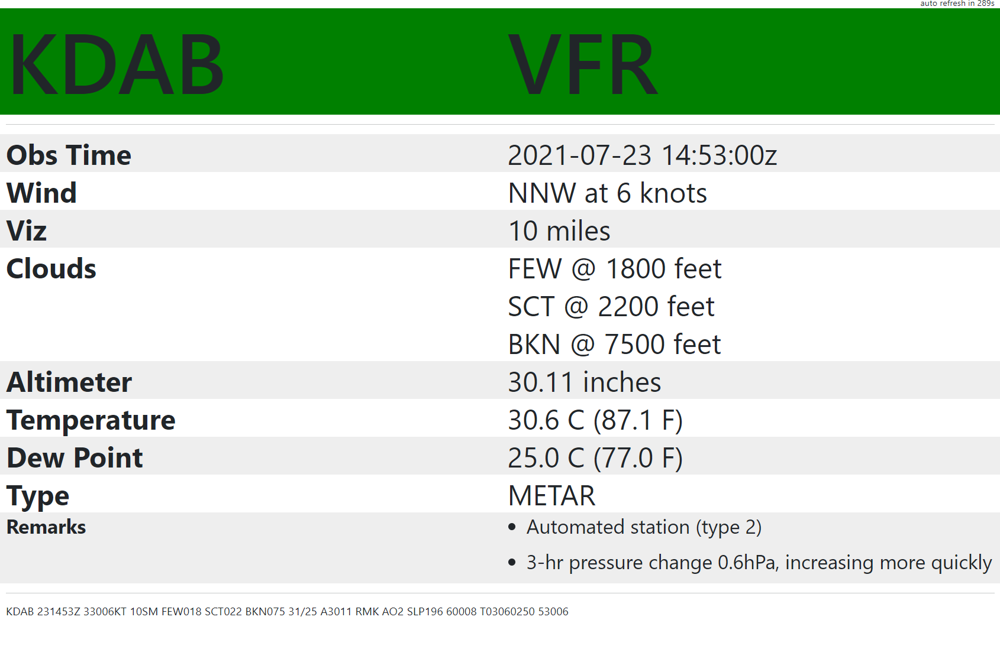
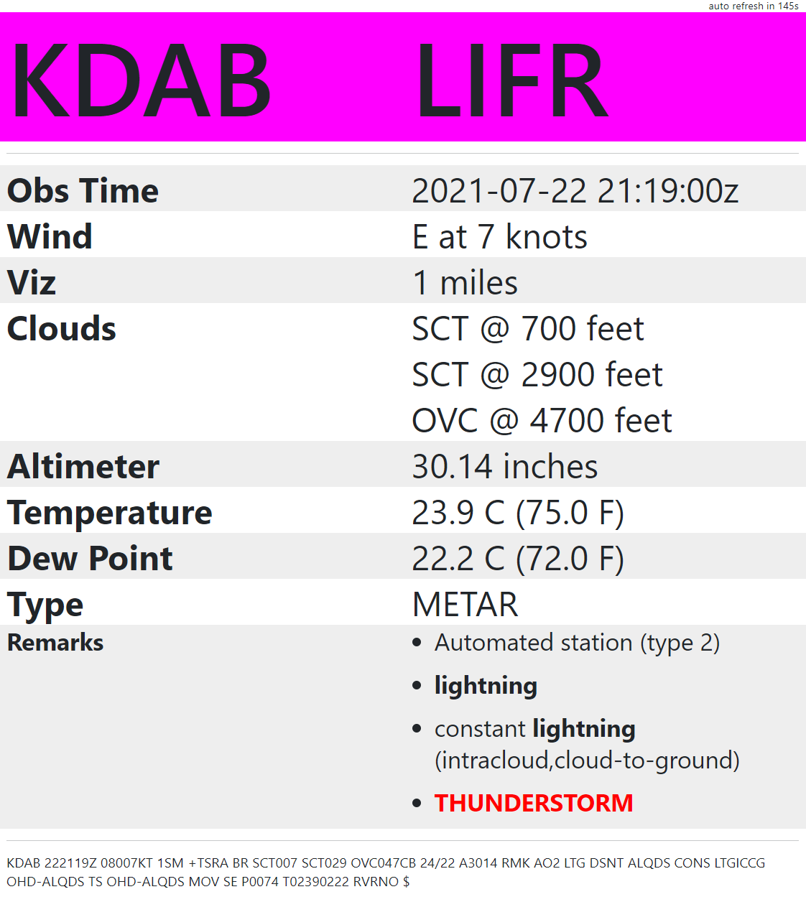

Metar-Display
===

Display metar information on the big screen in your hangar!







## Instal pre-reqs

```
pip install flask python-metar
```

## Run it

```
python server.py
```

## Usage

By default it shows the weather at KDAB (Daytona Airport)

You can add any identifier to get that airport instead:

`http://localhost:5000/KARR` to get KARR (Aurora Airport)
